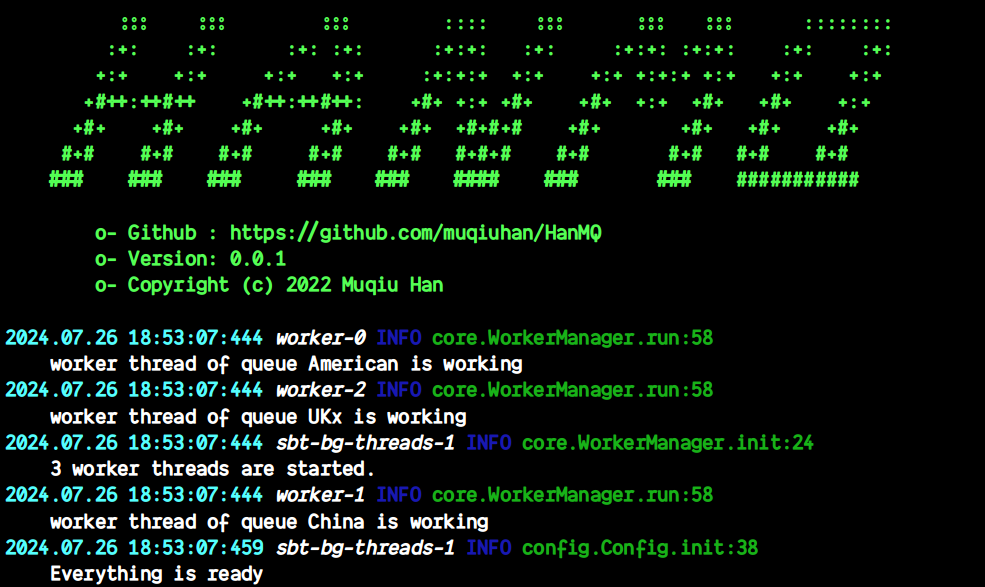

<div align="center">

# HanMQ

*A simple message queue based on netty, complete routing distribution using basic topic mode and written in Scala3*


[](https://github.com/muqiuhan/HanMQ/actions/workflows/Build.yaml)



</div>

## Introduction
HanMQ communication model is based on RabbitMQ's most basic Topics model:


The message queue is abstracted into Server and Client:

The thread group design of Server is mainly divided into three parts:
1. Handle network communication module
2. Put the message from the producer into the corresponding queue
3. Distribute messages in each queue to consumer

The basic model is a blocking queue, which implemented using BlockingQueue under the Java J.U.C package.

HanMQ has customized a simple message protocol. In order to facilitate expansion and take advantage of some existing application layer protocols, the WebSocket protocol is adopted:

```scala
/// Message protocol format:
/// consumer's subscription registration message:
///     { type: 0, extend: ["queue_name1","queue_name1"] }
/// General messages from the producer:
///     { type: 1, content: "message content", extend: "routing key" }
case class Message(
    typ: Int,
    content: String,

    /// If type is 0, extend is the queueName from the consumer, specifying which queue to connect to.
    /// If type is 1, extend is the routingKey from the producer
    extend: String,

    /// The time the message was sent
    date: String
)
```

## Usage

server:
```scala 3
@main
def main: Unit =
  com.muqiuhan.hanmq.server.Server.start()
```

client:
```scala 3
import com.muqiuhan.hanmq.client.{Producer, Consumer}
...
  val url = "ws://localhost:9993/";

  test("Test client") {
    val producer1 = new Producer(URI.create(url), "producer_1");
    val producer2 = new Producer(URI.create(url), "producer_2");
    val producer3 = new Producer(URI.create(url), "producer_3");
    val consumer1 = new Consumer(URI.create(url), "American");
    val consumer2 = new Consumer(URI.create(url), "China");
    val consumer3 = new Consumer(URI.create(url), "UK");

    producer1.send("Make America Great Again!", "American.great.again.!");
    producer2.send("China is getting stronger!", "China.daily.com");
    producer2.send("China sees 14.3 percent more domestic trips in H1", "China.xinhua.net");
    producer3.send("The voice from Europe", "UK.Reuters.com");

    consumer1.register("American", true);
    consumer1.onMessage(message => scribe.info("American: " + message));
    consumer2.register("China", true);
    consumer2.onMessage(message => scribe.info("China: " + message));
    consumer3.register("UK", true);
    consumer3.onMessage(message => scribe.info("UK: " + message));
...
```

output:
```
2024.07.27 10:25:54:496 WebSocketConnectReadThread-173 INFO com.muqiuhan.hanmq.client.Client.onOpen:20
    Client producer_1 connects successfully    
2024.07.27 10:25:54:520 WebSocketConnectReadThread-176 INFO com.muqiuhan.hanmq.client.Client.onOpen:20
    Client producer_2 connects successfully    
2024.07.27 10:25:54:527 WebSocketConnectReadThread-179 INFO com.muqiuhan.hanmq.client.Client.onOpen:20
    Client producer_3 connects successfully    
2024.07.27 10:25:54:538 WebSocketConnectReadThread-182 INFO com.muqiuhan.hanmq.client.Client.onOpen:20
    Client American connects successfully    
2024.07.27 10:25:54:544 WebSocketConnectReadThread-185 INFO com.muqiuhan.hanmq.client.Client.onOpen:20
    Client China connects successfully    
2024.07.27 10:25:54:550 WebSocketConnectReadThread-188 INFO com.muqiuhan.hanmq.client.Client.onOpen:20
    Client UK connects successfully    
2024.07.27 10:25:54:636 WebSocketConnectReadThread-185 INFO <empty>.TestClient.TestClient:24
    China: "China is getting stronger!"    
2024.07.27 10:25:54:636 WebSocketConnectReadThread-188 INFO <empty>.TestClient.TestClient:26
    UK: "The voice from Europe"    
2024.07.27 10:25:54:636 WebSocketConnectReadThread-182 INFO <empty>.TestClient.TestClient:22
    American: "Make America Great Again!"    
2024.07.27 10:25:54:636 WebSocketConnectReadThread-185 INFO <empty>.TestClient.TestClient:24
    China: "China sees 14.3 percent more domestic trips in H1"
```

## Dependencies

```scala 3
...
libraryDependencies ++= Seq(
    "com.lihaoyi"       %% "upickle"         % "4.0.0",
    "com.outr"          %% "scribe"          % "3.15.0",
    "org.scalameta"     %% "munit"           % "1.0.0" % Test,
    "io.netty"           % "netty-all"       % "4.1.50.Final",
    "org.apache.commons" % "commons-lang3"   % "3.4",
    "ch.qos.logback"     % "logback-classic" % "1.2.10",
    "org.java-websocket" % "Java-WebSocket"  % "1.3.8"
)
...
```

## Reference
- [RabbitMQ3.5.3 source code commented version for easy reading)](https://github.com/sky-big/RabbitMQ)
- [RabbitMQ Documentation](https://www.rabbitmq.com/documentation.html)
- [MiniMQ](https://github.com/Mr-Hades1/minimq)

## LICENSE
The MIT License (MIT)

Copyright (c) 2023 Muqiu Han

Permission is hereby granted, free of charge, to any person obtaining a copy
of this software and associated documentation files (the "Software"), to deal
in the Software without restriction, including without limitation the rights
to use, copy, modify, merge, publish, distribute, sublicense, and/or sell
copies of the Software, and to permit persons to whom the Software is
furnished to do so, subject to the following conditions:

The above copyright notice and this permission notice shall be included in all
copies or substantial portions of the Software.

THE SOFTWARE IS PROVIDED "AS IS", WITHOUT WARRANTY OF ANY KIND, EXPRESS OR
IMPLIED, INCLUDING BUT NOT LIMITED TO THE WARRANTIES OF MERCHANTABILITY,
FITNESS FOR A PARTICULAR PURPOSE AND NONINFRINGEMENT. IN NO EVENT SHALL THE
AUTHORS OR COPYRIGHT HOLDERS BE LIABLE FOR ANY CLAIM, DAMAGES OR OTHER
LIABILITY, WHETHER IN AN ACTION OF CONTRACT, TORT OR OTHERWISE, ARISING FROM,
OUT OF OR IN CONNECTION WITH THE SOFTWARE OR THE USE OR OTHER DEALINGS IN THE
SOFTWARE.
